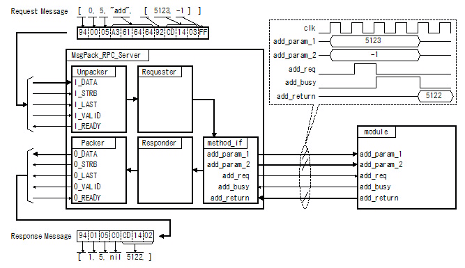

MessagePack for VHDL
====================

# Overview

## Introduction

MessagePack is an efficient binary serialization format. It lets you exchange data among multiple languages like JSON. But it's faster and smaller. Small integers are encoded into a single byte, and typical short strings require only one extra byte in addition to the strings themselves.

* MessagePack specification: https://github.com/msgpack/msgpack/blob/master/spec.md

MessagePack-RPC is cross-language RPC library for client, server and cluster applications.

* MessagePack-RPC specification : https://github.com/msgpack-rpc/msgpack-rpc/blob/master/spec.md

MessagePack for VHDL is pure and synthesizable VHDL implementation of MessagePack and MessagePack-RPC.

## Features

* MessagePack-VHDL is written in synthesizable VHDL.

Fig.1 Example MessagePack-RPC Server

 

## Licensing

Distributed under the BSD 2-Clause License.

